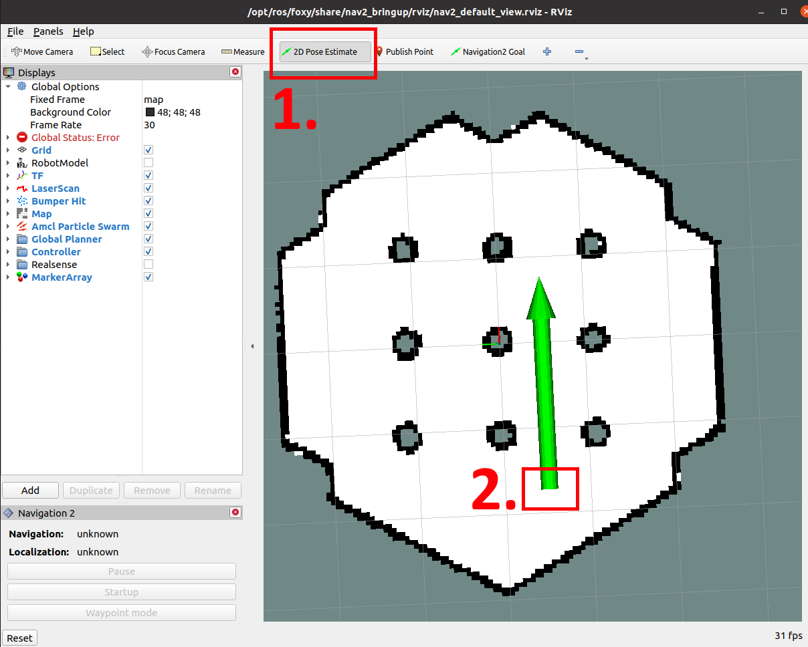
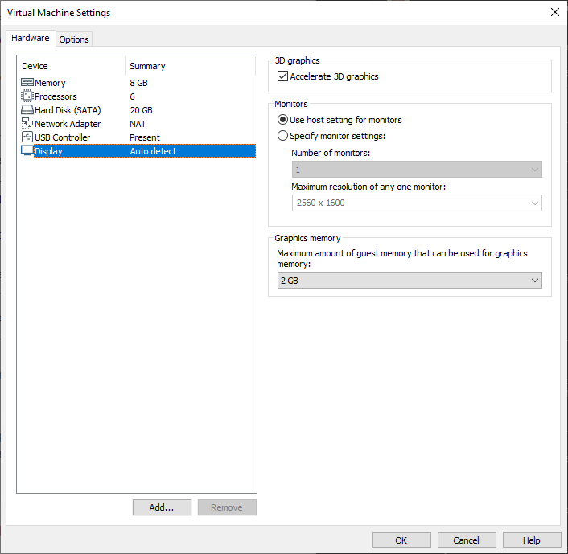

# AIHub Tampere Workshop
In this workshop, you will get to know the basics of ROS2 and Simulation Environment Gazebo.

For the basics of Linux commands and Troubleshooting, see the end of this document.

## Hands-on Gazebo Turtlebot Simulations
In ROS2, you will need to source the required workspaces. The given virtual machine will already have Ubuntu 20.04, ROS2 Foxy, Navigation2 stack installed. 
## Step 1 - Source: 
To activate those, whenever you open a new terminal, you need to write this commands;
```sh
source /opt/ros/foxy/setup.bash
source ~/turtlebot3_ws/install/setup.bash
```
If you are always using the same workspaces and you don't need to change anything, you can always add those two lines into the end of ~/.bashrc file. This way, each new terminal will already process those commands. But don't forget that the order of workspaces are crucial. If there are two packages in both workspaces, the package from last sourced workspace. 
## Step 2 - Launch Nodes
The Navigation2 Stack has a package called 'nav2_bringup'. In this package, there are launch files to either run a simulation, or run it on a real machine or another robot. This launch files and parameters are also a reference that you can use in your applications to create custom launch files for your needs. 

To run the simulation environment Gazebo, run following commands after sourcing.
```sh
ros2 launch nav2_bringup tb3_simulaton_launch.py
```

Tip: ROS2 has an autocomplete feature. After you enter some letters, you can use tab or double tab to complete the command.

## Step 3 - Give a 2D Pose Estimate
After Gazebo and RVIZ are initialized, you need to give an 2D Pose Estimate of the robot. This is required because in the beginning, the SLAM algorithm does not actually know where to look. By giving the 2D Estimate Pose, the SLAM algorithm, in this case just matching so ACML, matches the laser scan with the existing map file. Afterwards, you can see the location of the Robot on RVIZ, and continue giving Navigation2 Goal.

Click 2D Pose Estimate (1.), and click and drag at the 2. area to have a similar green arrow. You do not need to be exactly specific for this step, just a coarse estimation is enough. Even if the localization is bad at the start, by the time that robot is moving around, you can see that the localization gets better.

[]

For this environment, the spawn position of Turtlebot is defined to be at that corner. If you are not sure about the location, you can check the Gazebo window and you will see the robot's position and pose visually. 

## Step 4 - Give a Navigation2 Goal
By using the toolbox of RVIZ, you can give a command to Navigation2 Stack. This command invokes the behavior tree, takes the goal pose, sends it to planner server. After path is calculated by taking obstacles in account, controller server is invoked and starts following that route. In the slides, you can find visual information about it.

Click Navigation2 Goal (1.) and click and drag at a desired location within the map. You will see that the Navigation2 stack processes that goal, creates a path to goal and starts following. Meantime, in the command line, you can see the logs of Navigation2 stack, how the controller servers and navigators are processing.

[]

# Troubleshooting

## Gazebo just closes before loading the screen
It might be related to the Virtual Machine GPU management. if you write the following command before calling ros2 launch command, it might resolve this issue.
```sh
export SVGA_VGPU10=0
```

Also check the if the settings are as followed; 
[]

You can disable "Accelerate 3D Graphics" if your computer does not have a compatible GPU. 
